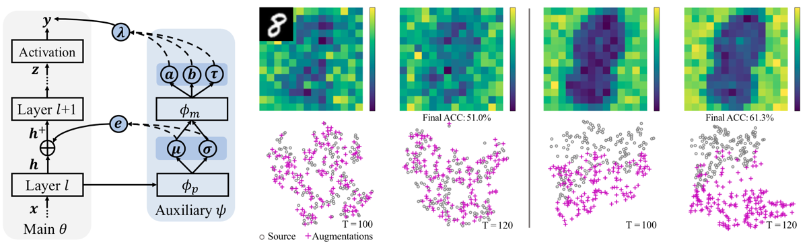

# Uncertainty-guided Model Generalization to Unseen Domains (CVPR 2021)

This repository holds the Pytorch implementation of [Uncertainty-guided Model Generalization to Unseen Domains](https://arxiv.org/pdf/2103.07531.pdf) by Fengchun Qiao and Xi Peng. 

## Introduction

We study a worst-case scenario in generalization: Out-of-domain generalization from a single source. The goal is to learn a robust model from a single source and expect it to generalize over many unknown distributions. This challenging problem has been seldom investigated while existing solutions suffer from various limitations. In this paper, we propose a new solution. The key idea is to augment the source capacity in both input and label spaces, while the augmentation is guided by uncertainty assessment.

<p align="center"></p>

## Prerequisites

This package has the following requirements:

* `Python 3.6`
* `Pytorch 1.1.0`
* `MetaNN 0.1.5`
* `Scipy 1.2.1`

## Training


Run the following command:

```
python main.py
```

## Citation

If you find our code useful in your research, please consider citing:

```
@InProceedings{Qiao_2021_CVPR,
    author    = {Qiao, Fengchun and Peng, Xi},
    title     = {Uncertainty-Guided Model Generalization to Unseen Domains},
    booktitle = {Proceedings of the IEEE/CVF Conference on Computer Vision and Pattern Recognition (CVPR)},
    month     = {June},
    year      = {2021},
    pages     = {6790-6800}
}
```
